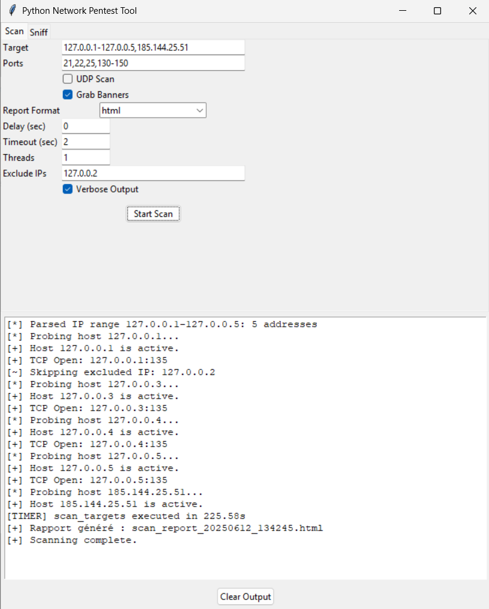
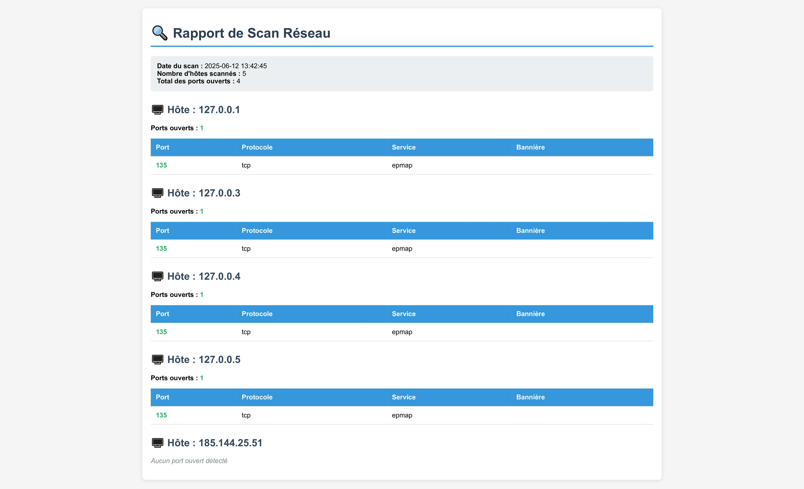
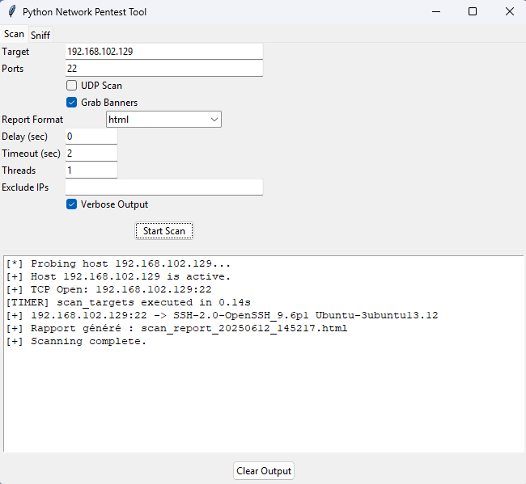
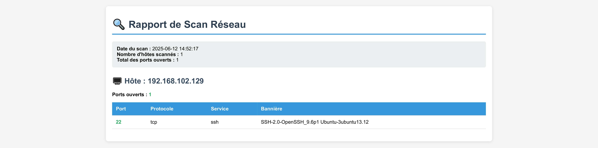
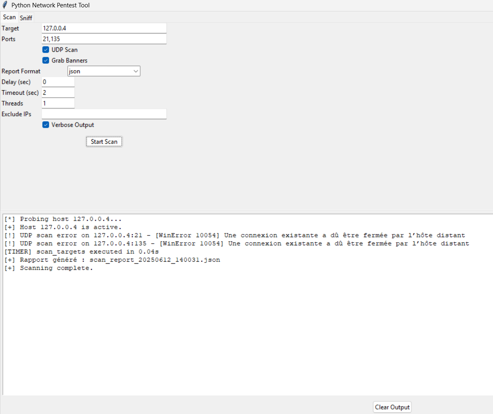
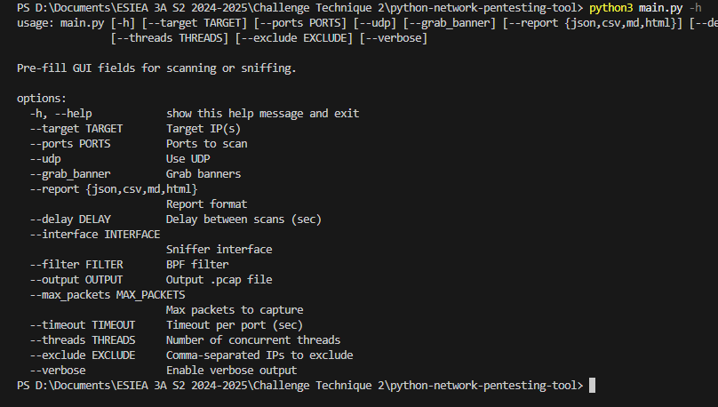
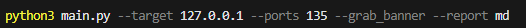
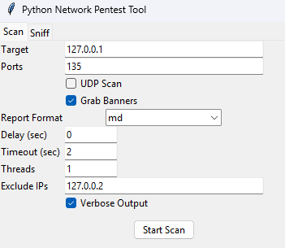
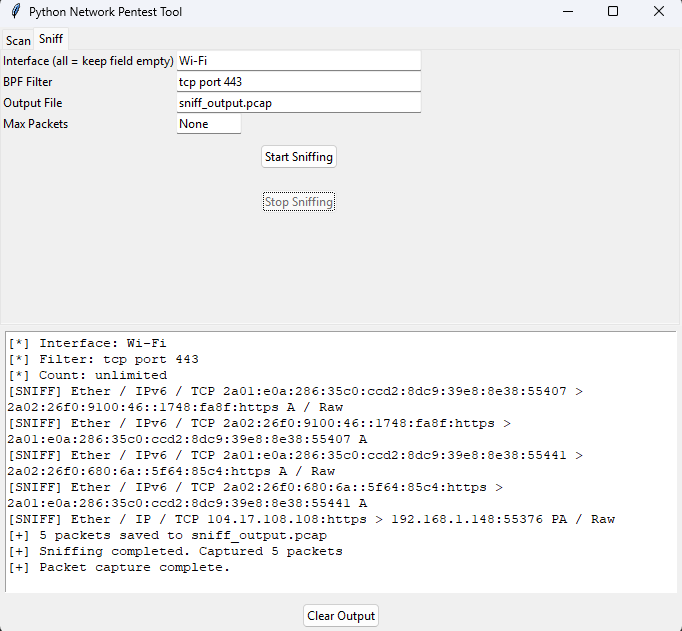

# 🔍 Python Network Pentest Tool

Un outil de pentest réseau complet développé en Python, inspiré de Nmap, capable de scanner des plages IP, identifier les ports ouverts, récupérer des bannières, sniffer le trafic réseau et générer des rapports détaillés.

## 📋 Table des matières

- [Fonctionnalités](#-fonctionnalités)
- [Architecture](#-architecture)
- [Installation](#-installation)
- [Utilisation](#-utilisation)
  - [Ligne de commande](#ligne-de-commande)
  - [Interface graphique](#interface-graphique)
- [Exemples d'utilisation](#-exemples-dutilisation)
- [Options scanner](#-options)
  - [Options basique](#-options-basique)
  - [Options avancées](#-options-avancées)
- [Options sniffer](#-options)
- [Génération de rapports](#-génération-de-rapports)
- [Sécurité et éthique](#-sécurité-et-éthique)
- [Architecture technique](#-architecture-technique)
- [Limitations](#-limitations)
- [Développements futurs](#-développements-futurs)
- [Captures d'écran](#-Captures-d'écran)

## 🚀 Fonctionnalités

### ✅ Fonctionnalités principales
- **Scanner réseau** : Détection d'hôtes actifs et scan de ports TCP/UDP
- **Banner Grabbing** : Récupération automatique des bannières de services
- **Sniffer réseau** : Capture de
 paquets avec filtres BPF personnalisables
- **Génération de rapports** : Export en JSON, CSV, Markdown et HTML
- **Interface graphique** : GUI Tkinter intuitive avec onglets
- **Multi-threading** : Support des scans parallèles pour de meilleures performances

### 🎯 Formats de cibles supportés
- IP simple : `192.168.1.1`
- Plage CIDR : `192.168.1.0/24`
- Plage personnalisée : `192.168.1.1-192.168.1.10`
- Liste d'IP : `192.168.1.1,192.168.1.5,192.168.1.10`

## 🏗️ Architecture

Le projet est organisé en modules fonctionnels distincts :

```
├── main.py              # Point d'entrée avec GUI et CLI
├── scanner.py           # Scanner IP et ports (TCP/UDP)
├── banner_grabber.py    # Récupération des bannières
├── sniffer.py           # Capture de paquets réseau
├── reporter.py          # Génération de rapports
├── utils.py             # Fonctions utilitaires
└── README.md            # Documentation
```

## 📦 Installation

### Prérequis
- Python 3.7+

### Dépendances
```bash
pip install scapy tkinter
```

## 💻 Utilisation

### Ligne de commande

La ligne de commande pré-remplit l'interface graphique avec les options souhaitées.

```bash
python main.py [OPTIONS]
```

### Interface graphique

Lancez simplement le script sans arguments pour ouvrir l'interface graphique :

```bash
python main.py
```

L'interface propose deux onglets :
- **Scan** : Configuration et lancement des scans réseau
- **Sniff** : Capture de paquets réseau

## 📖 Exemples d'utilisation

### Scans basiques

```bash
# Scan d'une IP sur les ports courants
python main.py --target 192.168.1.10 --ports 21,22,25,80,110,443

# Scan d'un sous-réseau complet
python main.py --target 192.168.1.0/24 --ports 1-1024

# Scan avec récupération de bannières
python main.py --target 192.168.1.10 --ports 21,22,80 --grab_banner
```

### Scans avancés

```bash
# Scan UDP avec rapport JSON
python main.py --target 192.168.1.0/24 --ports 53,161 --udp --report json

# Scan multi-threadé avec exclusions
python main.py --target 192.168.1.0/24 --ports 1-1000 --threads 50 --exclude 192.168.1.1,192.168.1.254

# Scan lent avec délai
python main.py --target 192.168.1.10 --ports 1-100 --delay 2 --timeout 5
```

### Capture réseau

```bash
# Sniffer sur toutes les interfaces
python main.py --interface "" --filter "tcp port 80" --max_packets 100

# Capture avec sauvegarde
python main.py --interface eth0 --output capture.pcap --max_packets 500

# Filtrage avancé
python main.py --interface Wi-Fi --filter "host 192.168.1.1 and port 443"
```

## 🛠️ Options scanner :


### Options basiques :

| Option | Description | Valeur par défaut |
|--------|-------------|-------------------|
| `--target` | IP(s) cible(s) | `127.0.0.1-127.0.0.4,127.0.0.5` |
| `--ports` | Ports à scanner | `21,22,25,80,110,135,143,443,445` |
| `--udp` | Activer le scan UDP | `False` |
| `--grab_banner` | Récupérer les bannières | `True` |
| `--report` | Format de rapport | `html` |
| `--delay` | Délai entre scans (sec) | `0` |


### Options avancées :

| Option | Description | Valeur par défaut |
|--------|-------------|-------------------|
| `--timeout` | Timeout par port (sec) | `2` |
| `--threads` | Nombre de threads | `1` |
| `--exclude` | IPs à exclure | `127.0.0.2` |
| `--verbose` | Mode verbeux | `True` |


## 🛠️ Options sniffer :

| Option | Description | Valeur par défaut |
|--------|-------------|-------------------|
| `--interface` | Interface réseau | `Wi-Fi` |
| `--filter` | Filtre BPF | `tcp port 443` |
| `--output` | Fichier de sortie .pcap | `sniff_output.pcap` |
| `--max_packets` | Limite de paquets | `30` |


## 📊 Génération de rapports

L'outil supporte 4 formats de rapport :

### JSON
```json
{
  "scan_info": {
    "timestamp": "2025-06-12T10:30:00",
    "total_hosts": 5,
    "total_open_ports": 12
  },
  "results": {
    "192.168.1.1": {
      "status": "up",
      "open_ports": 3,
      "ports": [
        {
          "port": 22,
          "protocol": "tcp",
          "service": "ssh",
          "banner": "OpenSSH 7.4"
        }
      ]
    }
  }
}
```

### HTML
Rapport web interactif avec CSS intégré, tableaux triables et design responsive.

### Markdown
Format idéal pour la documentation technique avec syntaxe GitHub.

### CSV
Format compatible avec Excel et outils d'analyse de données.

## 🔒 Sécurité et éthique

⚠️ **IMPORTANT** : Cet outil est destiné uniquement à des fins éducatives et de test sur des environnements autorisés.

### Utilisation légale
- ✅ Tests sur vos propres machines
- ✅ Environnements de laboratoire (Metasploitable, DVWA)
- ✅ Réseaux avec autorisation écrite explicite
- ❌ Scan de réseaux tiers sans autorisation
- ❌ Utilisation malveillante

### Recommandations
- Utilisez des machines virtuelles isolées
- Respectez les politiques de sécurité de votre organisation
- Limitez l'intensité des scans pour éviter la surcharge réseau

## 🔧 Architecture technique

### Composants principaux

#### Scanner (`scanner.py`)
- **Détection d'hôtes** : Ping ICMP multi-plateforme
- **Scan TCP** : Socket connect avec timeout configurables  
- **Scan UDP** : Détection basée sur les réponses ICMP
- **Multi-threading** : Pool de workers pour les performances
- **Gestion d'erreurs** : Récupération des erreurs

#### Banner Grabber (`banner_grabber.py`)
- **Connexion non-bloquante** : Utilisation de `select()` pour éviter les blocages
- **Timeout intelligent** : Adaptation selon le type de service
- **Encodage robuste** : Gestion des caractères non-ASCII
- **Cache des résultats** : Évite les connexions redondantes

#### Sniffer (`sniffer.py`)
- **Interface Scapy** : Capture de paquets avec Scapy
- **Filtres BPF** : Syntaxe compatible tcpdump/Wireshark
- **Sauvegarde PCAP** : Format standard pour l'analyse

#### Reporter (`reporter.py`)
- **Templates modulaires** : Génération multi-format
- **Métadonnées enrichies** : Horodatage, statistiques, contexte

### Gestion des erreurs
- Validation stricte des entrées utilisateur
- Récupération des timeouts réseau

### Performance
- **Multi-threading** : Jusqu'à 100 threads simultanés
- **Pool de connexions** : Réutilisation des sockets
- **Mise en cache** : Évite les opérations redondantes
- **Optimisation mémoire** : Traitement en streaming pour les gros volumes

## 📝 Limitations

### Techniques
- **Détection de pare-feu** : Certains firewall peuvent bloquer ou ralentir les scans
- **Services non-standard** : Banner grabbing limité aux services qui exposent des bannières
- **Performance UDP** : Scan UDP naturellement plus lent que TCP
- **Privilèges système** : Sniffing nécessite des droits administrateur

### Fonctionnelles
- **Pas de scan SYN** : Utilise uniquement TCP connect (plus détectable)
- **Détection d'OS limitée** : Pas d'empreinte système avancée
- **Pas de contournement** : Aucune technique d'évasion IDS/IPS
- **Interface simple** : GUI basique sans graphiques avancés

## 🚀 Développements futurs

### Améliorations prévues
- [ ] **Scan SYN** : Implémentation du scan furtif avec raw sockets
- [ ] **Détection d'OS** : Fingerprint basé sur les réponces TCP
- [ ] **Module exploit** : Intégration de tests de vulnérabilités basiques  
- [ ] **Scan IPv6** : Support complet du protocole IPv6
- [ ] **Interface web** : Dashboard HTML5 temps réel
- [ ] **Machine learning** : Classification automatique des services
- [ ] **Géolocalisation** : Mapping des adresses IP

### Optimisations
- [ ] **Base de données** : Persistance des résultats avec SQLite
- [ ] **Configuration** : Fichiers de profils prédéfinis
- [ ] **Plugins** : Architecture modulaire extensible


## Captures d'écran

### Exemple de Scan TCP avec génération de rapport
- Capture 1 : [Configuration de l'interface pour un scan TCP avec rapport HTML]

  

- Capture 2 : [Rapport HTML du scan TCP montrant les ports ouverts et l'exclusion d'IPs]

  

### Exemple de Scan TCP avec génération de rapport et bannières
- Capture 3 : [Configuration de l'interface pour un scan TCP avec rapport HTML et bannière]

  

- Capture 4 : [Rapport html du scan TCP montrant le ports ouverts, le service ssh et la bannière]

  


### Exemple de Scan UDP et génération de rapport
- Capture 5 : [Configuration de l'interface pour un scan UDP avec rapport JSON]

  

- Capture 6 : [Rapport JSON du scan UDP]

  


### Exemple de scan en pré-remplissant avec la ligne de commande
- Capture 7 : [Affichage de l'aide d'utilisation]

  

- Capture 8 : [Champs à pré-remplir en ligne de commande]

  

- Capture 9 : [Interface graphique pré-remplie]

  

### Exemple de sniffer en action
- Capture 10 : [Affichage du traffic avec un filtre et sauvegarde des paquets pour sous format pcap]

  


